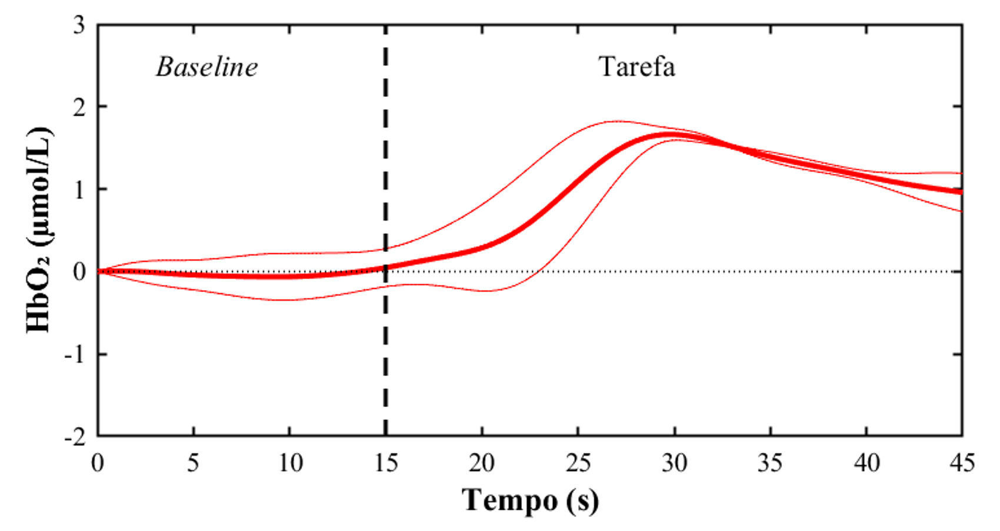

# Análise dos dados da fNIRS

    Os códigos foram desenvolvidos para analisar a resposta cortical hemodinâmica (alteração nas concentrações de Oxy e Desoxy-hemoglobina), mensuradas pelo dispositivo fNIRS modelo OctaMon de 8 canais (Artinis Medical Systems, Elst, The Netherlands). Se você estiver trabalhando com outros sistemas fNIRS, as rotinas deverão ser modificadas.
      
      
    <b> Todos os códigos deste projeto devem estar na mesma pasta do seu computador! </b>

## Desenvolvedor 
Prof. Me. Gabriel Antonio Gazziero Moraca

## 1º Passo - Encontrar os eventos da coleta

    A aquisição e armazenamento dos dados é realizada por meio do software OxySoft. Após coletar os dados, realize os procedimentos abaixo:

- Exporte os dados em arquivos Excel;
- Exclua o cabeçalho, os valores discrepantes iniciais e a 1ª coluna (frames);
- Digite "**a**" na 1ª linha da coluna que contém os eventos da coleta.

    <blockquote>
        Caso o pacote Office não esteja instalado no pc/notebook utilizado na coleta, exporte os dados em arquivos de texto (.txt) e em seguida copie e cole os dados no Excel.
    </blockquote> 

    Após estas preparações, rode o arquivo <code>fNIRS_Find_Events.m</code> no MatLab. De maneira geral, esta rotina possui as seguintes etapas:

### Exibindo instruções ao usuário

    - No início da execução da rotina, mensagens serão exibidas na tela inicial do MatLab. Basicamente, são lembretes sobre os procedimentos descritos acima e informações sobre os arquivos que serão gerados. Caso exista um <b>evento baseline</b> no seu protocolo, considere-o como uma condição experimental nesta rotina.

### Adicionando informações sobre o protocolo experimental

    Caixas de diálogo serão exibidas na tela para você definir:

- A quantidade de condições experimentais.
- A quantidade e as letras que marcaram os eventos de cada condição.
- O diretório que contém os dados exportados e um diretório para salvar os arquivos que serão gerados.

### Selecionando os eventos de interesse

    - Uma janela com todos os eventos marcados será exibida e você deverá selecionar os eventos de interesse. Não selecione mais eventos do que a quantidade definida na etapa anterior, caso contrário, a rotina retornará um erro. Por exemplo, se você definiu que há 9 eventos no protocolo, não selecione 10 eventos.

### Salvando os eventos

    - Todos os eventos selecionados serão salvos em um único arquivo <code>.mat</code>. Além disso, os dados da Oxy e Desoxy que foram carregados serão salvos em um arquivo <code>.txt</code>.

## 2º Passo - Correção de artefatos e filtragem

    Para aplicar procedimentos de correção de artefatos e filtragem dos dados, será necessário utilizar o software open-source <b>NIRS-SPM</b> (toolbox do MatLab). Os arquivos gerados no passo anterior serão utilizados neste 2º passo da análise. Abaixo há links para o software e para artigos que explicam o pré-processamento dos sinais.

  

- Software: [NIRS-SPM](http://www.fil.ion.ucl.ac.uk/spm/software/)
- Statistical parametric mapping for near-infrared spectroscopy - [Ye et al., 2009](https://pubmed.ncbi.nlm.nih.gov/18848897/) 
- fNIRS response during walking — Artefact or cortical activity? A systematic review - [Vitorio et al., 2017](https://pubmed.ncbi.nlm.nih.gov/29017917/)
- Motion artifacts in functional near-infrared spectroscopy - [Brigadoi et al., 2014](https://pubmed.ncbi.nlm.nih.gov/23639260/)
- A systematic comparison of motion artifact correction techniques for functional near-infrared spectroscopy - [Cooper et al., 2012](https://pubmed.ncbi.nlm.nih.gov/23087603/)

## 3º Passo - Cálculo da mudança relativa da atividade cortical

    Após encontrar os eventos e e processar os dados no NIRS-SPM, rode o arquivo <code>fNIRS_Analysis.m</code> no MatLab. Os arquivos <code>fNIRSplots_Channels.m</code> e <code>fNIRSplots_ConditionsData.m</code> são funções que serão utilizadas para plotar os dados ao longa da análise. Em resumo, esta rotina executa as seguintes etapas:

### Exibindo instruções ao usuário

    - Antes de iniciar a análise propriamente dita, mensagens serão exibidas na tela inicial do MatLab. Basicamente, há uma explicação geral sobre a análise e a plotagem dos dados e informações sobre como preencher determinados campos subsequentes. É <b>essencial</b> ter conhecimento sobre o protocolo experimental e ter realizado os passos 1 e 2 previamente.

### Adicionando informações sobre o protocolo experimental

    Caixas de diálogo serão exibidas na tela para você definir:

- A quantidade e o nomes de cada condição experimental.
- As letras que definiram os eventos de cada condição.
- Como os arquivos contendo os eventos estão organizados no seu computador.
- Se houve aplicação da estimulação transcraniana por corrente contínua (ETCC).
- O diretório onde estão a rotina e as funções para plotar os dados.
- Os diretórios para salvar os gráficos dos canais e da análise de cada condição e para salvar os os dados analisados.

### Adicionando informações sobre a análise dos dados

    Novamente, caixas de diálogo serão exibidas na tela para você definir:

- Se houve um evento baseline e qual a letra utilizada para identificá-lo.
- A duração total do baseline realizado na coleta.
- Quantos segundos, imediatamente antes do término do baseline, serão excluídos da análise.
- A duração do atraso fisiológico.
- A duração total da tarefa realizada na coleta e dos janelamentos "Early" e "Late".
- Quanto segundos, imediatamente antes do término da tarefa, seráo excluídos da análise.

    <blockquote>
        Imediatamente após o início do baseline e imediatamente após o início da tarefa, alguns segundos serão excluídos da análise. Este tempo é a duração do atraso fisiológico.
    </blockquote>

### Analisando os dados processados

    - Nesta etapa, você irá definir qual hemisfério foi estimulado, se houve aplicação de ETCC em um hemisfério específico. Em seguida, a rotina irá carregar os eventos do participante em análise e 2 gráficos serão exibidos:
      
    1) Dados adquiridos pelos canais do hemisfério direito (1-4).
     
    2) Dados adquiridos pelos canais do hemisfério esquerdo (5-8).
      
    - Os gráficos serão salvos com a extensão <code>.fig</code>, permitindo a edição posterior caso necessário. Estes gráficos representam o comportamento da Oxy e da Desoxy durante todo o tempo de coleta (exemplo abaixo).
      
     
    

<!-- -->

     
    - Após inspecionar os gráficos, uma janela será exibida para você selecionar os canais de interesse (que possuem sinais com qualidade).
      
    - Durante a coleta de dados, é importante que você anote os canais que apresentaram sinais ruins, para não selecioná-los neste momento.
     
    - As médias <b>entre os canais</b> (uma média por frame) de cada hemisfério cerebral serão calculadas. O resultado será 4 conjunto de dados: Oxy e Desoxy de cada hemifério.

 

**Para cada condição experimental, a rotina irá executar os tarefas a seguir:**

    - Para cada tentativa, os dados do baseline e da tarefa serão agrupados em uma série temporal e o 1º valor será subtraído de todo o conjunto de dados.
     
    - Após criar "n" séries temporais, as médias entre as séries serão calculadas. Isto resultará em 4 séries temporais médias, uma para cada variável (Oxy e Desoxy de cada hemisfério).
     
    - Ainda, será calculada a média entre os hemisférios, gerando mais 2 conjunto de dados. 
    - Serão exibidos gráficos demonstrando o comportamento de cada série temporal média criada, 6 ao todo.
      
    - Como anteriormente, os gráficos também serão salvos com a extensão <code>.fig</code>, para permitir edição futura.
      
    - Exemplo abaixo demonstra a Oxy do hemisfério direito (as linhas finas representam os desvios-padrão).

     
    

     
    <blockquote>
        Subtrair o 1º valor é uma forma de normalizar os dados, para que a série temporal comece do 0. Esta normalização melhora a visualização da plotagem dos dados e não altera o comportamento do sinal.
    </blockquote>

     
    - A linha pontilhada indica o início da tarefa. Para ajustar a posição deste objeto conforme o seu protocolo, acesse o arquivo <code>fNIRSplots_ConditonsData</code> e modifique os valores das linhas 58 e 101.
     
    - Se no seu protocolo houve um evento baseline, não serão observados desvios-padrão na parte do gráfico referente ao baseline, pois todas as tentativas compartilharam o mesmo baseline (a média das tentivas será o próprio baseline).
     
    - Na sequência, partes do sinal do baseline e da tarefa serão excluídos (de acordo com o que você definiu no início da análise) e as médias do baseline e da tarefa (para cada janelamento) em cada série temporal média serão computadas.
     
    - Por fim, será calculada a <b>mudança relativa da atividade cortical (tarefa - baseline)</b> para cada variável (6) em cada janelamento (3).

### Salvando os dados

    - Considerando a Oxy e Desoxy de cada hemisfério e dos hemisférios combinados, os dados abaixo serão dispostos em tabelas que serão salvas em um único arquivo <code>.mat</code>:

- As mudanças relativas do janelamento Total para cada condição.
- As mudanças relativas do janelamento Early para cada condição.
- As mudanças relativas do janelamento Late para cada condição.
- As séries temporais médias de cada condição.
- Os desvios-padrão das séries temporais médias de cada condição.

    - Ainda, os canais utilizados na análise também serão salvos no mesmo arquivo. No nome do arquivo, haverá a expressão "HD" (hemisfério direito) ou "HE" (hemisfério direito) caso a ETCC tenha sido aplicada em algum dos hemisférios.

## 4º Passo - Agrupar os resultados

    Após calcular as variáveis no passo anterior, rode o arquivo <code>fNIRS_Grouping_Results.m</code> no MatLab. Esta rotina possui as seguintes etapas:

### Exibindo instruções ao usuário

    - No início da execução da rotina, mensagens serão exibidas na tela inicial do MatLab. Estas mensagens fornecerão instruções sobre a organização dos dados analisados e sobre como preencher determinados campos subsequentes.

### Adicionando informações sobre o protocolo experimental

    Caixas de diálogo serão exibidas na tela para você definir:

- A quantidade de condições experimentais, momentos de avaliação e intervenções.
- Os nomes de cada condição, momento e intervenção.
- Os diretórios que contém os resultados de cada arquivo e para salvar os resultados agrupados.

    <blockquote>
        A rotina foi criada para funcionar com diferentes delineamentos de pesquisa. Dependendo do protocolo, não será necessário nomear o momento e/ou intervenção.... Preste atenção nas instruções iniciais!
    </blockquote>

### Selecionando os arquivos analisados

    - Uma janela com todos os arquivos analisados será exibida e você deverá selecionar apenas os arquivos contendo os dados do momento e/ou intervenção especificado na janela. Para exemplificar, considere os seguintes protocolos:
     

- 2 momentos e 2 intervenções (ensaio clínico randomizado).
- 1 momento e nenhuma intervenção (estudo transversal).

    - No 1º caso, você irá selecionar os arquivos do conjunto "intervenção 1 - momento 1". Logo após, outra janela será aberta e você deverá selecionar os arquivos do conjunto "intervenção 1 - momento 2", depois do conjunto "intervenção 2 - momento 1" e assim sucessivamente. No 2º caso, apenas uma janela será aberta e basta selecionar todos os arquivos de interesse.

### Selecionando os resultados de cada arquivo

    - Primeiramente, você irá definir o janelamento dos dados a ser agrupados (Total, Early ou Late). Para cada arquivo selecionado na etapa anterior, a rotina irá extrair o número dos canais utilizados na análise dos dados (entre 1 e 8). Além disso, serão selecionadas as seguintes variáveis, para cada condição experimental:
     

 

- Oxy e Desoxy dos hemisférios direito e esquerdo OU estimulado e não-estimulado.
- Oxy e Desoxy dos hemiférios combinados (médias entre os hemisférios).

### Agrupando os resultados

    - Nesta etapa, os resultados extraídos serão agrupados de acordo com as condições experimentais, momentos de avaliação e intervenções aplicadas. Caso não exista intervenção, os resultados serão agrupados apenas por condição.

 

### Salvando os resultados agrupados

    - Os canais analisados de todos os participantes serão salvos em um arquivo <code>.txt</code> e os resultados agrupados em arquivos <code>.xlsx</code> (Excel). A quantidade de arquivos que serão gerados depende do protocolo experimental. Observe exemplos com protocolos diferentes:

- 2 condições e 1 momento.
- 2 condições, 2 momentos e 2 intervenções.

    - Para o 1º exemplo, serão produzidos 2 arquivos, um para cada condição. Já para o 2º exemplo, serão produzidos 4 arquivos (abaixo). Cada arquivo terá 2 planilhas (abas), uma para cada momento.
      
    1º Arquivo: condição 1 e intervenção 1.
      
    2º Arquivo: condição 1 e intervenção 2.
      
    3º Arquivo: condição 2 e intervenção 1.
      
    4º Arquivo: condição 2 e intervenção 2. 

 

---
#### Aqui termina a análise dos dados da fNIRS! Agora siga com a análise estatística de interesse, boa sorte 🤙🏻